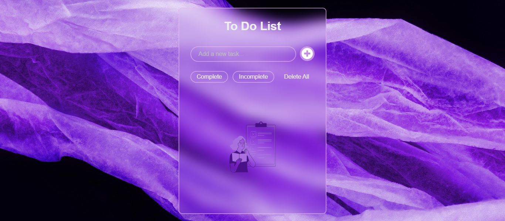

# To-Do List Application

This is a simple to-do list application built with HTML, CSS, and JavaScript. It allows users to:

- Add tasks with a button.
- Mark tasks as completed by ticking them off.
- Filter tasks to view completed or incomplete tasks.
- Delete all tasks with a single button.

## Features

- **Add Task:** You can easily add tasks to the list by typing in a text box and clicking the "Add Task" button.
- **Task Completion:** Tasks can be marked as complete by clicking a checkbox, which visually strikes through the task.
- **Filtering System:** You can filter tasks by their status (completed or incomplete) with the provided filter buttons.
- **Delete All:** A button is available to delete all tasks from the list.

## How to Use

1. Open the `index.html` file in your web browser.
2. Type a task in the input field and click on the "Add Task" button to add it to the list.
3. Click the checkbox next to a task to mark it as completed.
4. Use the "Show Completed" and "Show Incomplete" buttons to filter tasks by their status.
5. Use the "Delete All" button to clear the entire list.

## Technologies Used

- **HTML**: Structure of the application.
- **CSS**: Styling and layout of the app.
- **JavaScript**: Functionality for adding, completing, filtering, and deleting tasks.

## Screenshot

Below is a screenshot of the To-Do List application:

## Acknowledgements

- **Background Image**: The background image used in this project was sourced from [Pixels](https://www.pexels.com/).
- **Design Inspiration**: The design layout was inspired by [LearnTime](https://www.learn-time.com/).
- **Color Palette**: The color scheme was generated using [Coolors](https://coolors.co/).

## License

This project is open source and available under the [MIT License](LICENSE).
